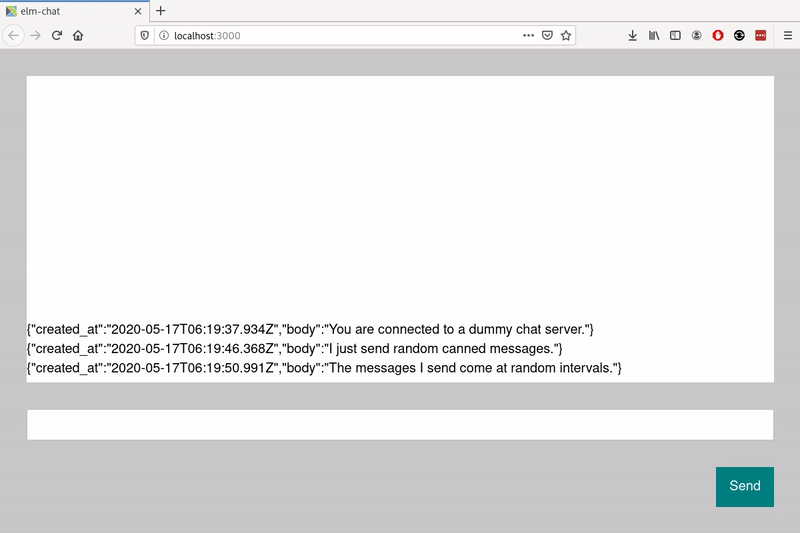

# PRETTY MUCH ABANDONED!

This little experiment kind of got stuck and I moved on to a different way of implementing an Elm chat app elsewhere. Key takeaways?
* It was challenging to build this with Elm-UI. It was much easier to do this in CSS by putting the messages in a `{ display: flex; flex-direction: column-reverse }` and going from there.
* The desired scrolling behavior can come almost "for free" with this bit of JavaScript...
`
function scrollToBottom() {
  const el = document.getElementById('messages');  // select the element containing all the messages
  el.style.scrollBehavior = "smooth"; // toggle the browser's native scrolling behavior to smooth, which means it will animate
  el.scrollTop = el.scrollHeight; // scroll to the bottom
}
` 
...and hooked up to an Elm port to be executed when a new message comes in.
* Getting that "ever so slightly stuck at the bottom until you deliberately scroll up instead of just responding to increased height of the container" behavior was tricky. Doing that well might require bringing the scroll measurement and manipulation into the Elm program. Fortunately, the docs for [Browser.Dom#getViewportOf](https://package.elm-lang.org/packages/elm/browser/latest/Browser-Dom#getViewportOf) anticipate this exact use case.


# Elm Chat

A Slack-like web UI for chat.

## Details

Apart from becoming a serviceable chat application of some kind, another goal of this project is to see how much fussing it really takes to do the finicky JS/CSS bits correctly in Elm and Elm-UI. Examples:

* New messages arrive at bottom of scrollable feed. Scrolling up allows the user to read past messages at their own pace. Scrolling to the bottom resumes new messages pushing up the others.

* `[Enter]` key to send a message, `[Shift + Enter]` to make a line break in the draft message.



One other interesting thing to note is that the Elm community is deferring a WebSocket effect manager. The standard way to connect to a WebSocket is through Elm's ports system, which is what has been done here. Illustrated:

```
+---------+                  +--------------------+               +-------------+
| ELM APP | <-> ELM PORTS -> | JS INIT/WS WRAPPER | <-> WS:// <-> | CHAT SERVER |
+---------+                  *--------------------+               +-------------+
```

## Dummy chat server

There's a dummy chat server in /dummy-server. `cd dummy-server && npm install && npm start` to get it going.

## Practical README stuff

Elm Chat is an application bootstrapped with [Create Elm App](https://github.com/halfzebra/create-elm-app).

The [guide](https://github.com/halfzebra/create-elm-app/blob/master/template/README.md) for Create Elm App is fantastic. Refer to it for instructions on building, running tests, development environment how-tos, PWA stuff, and deployment.
